# TiDE Step-by-Step Guide

## 1. Install TiUP

If you haven't installed [TiUP](https://docs.pingcap.com/tidb/stable/tiup-overview), the extension will prompt you to install it:

<div>
  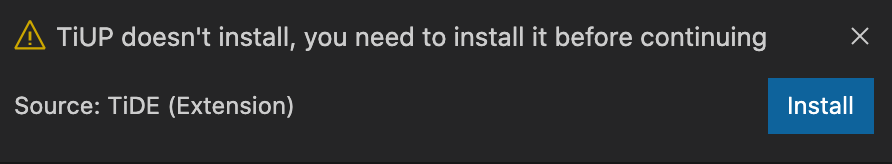
</div>

## 2. Clone and import repos

Then you need to clone repos (tidb/tikv/pd/tidb-dashboard) to local if you haven't.

```shell
$ mkdir tidb-repos && cd tidb-repos
$ git clone https://github.com/pingcap/tidb.git
$ git clone https://github.com/pingcap/tikv.git
$ git clone https://github.com/pingcap/pd.git
$ git clone https://github.com/pingcap/tidb-dashboard.git
```

> Note: you don't need to clone all repos, but only the repos you want to develop.

Open any repo in VS Code, for example, tidb, then select **File > Add Folder to Workspace...** to add other repo folders to VS Code. VS Code will automatically organize them as an untitled workspace.

> Note: again, you don't need to add all repos, but only the repos you want to develop.

<div>
  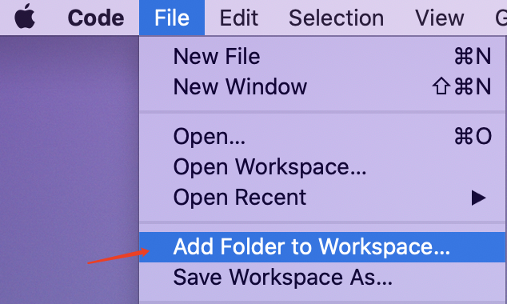
</div>

<div>
  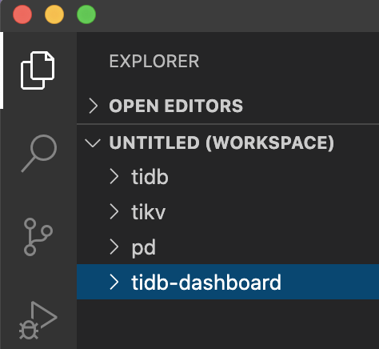
</div>

Save the workspace by the menu **File** / **Save Workspace as ...** to any path, for example save it as "tidb-dev.code-workspace".

<div>
  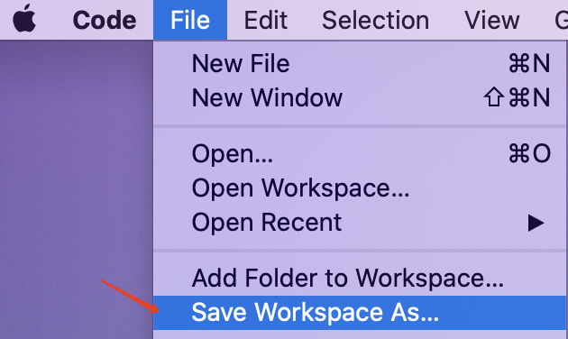
</div>

<div>
  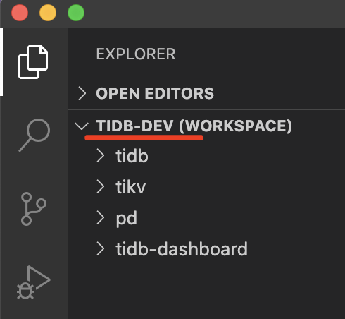
</div>

## 3. Set up build tools

(Currently, we need to manually set them up, but we will try to automate some of them later.)

Required tools for building:

1. TiDB

   - [`Go 1.13+`](https://golang.org/doc/install)
   - [Go for Visual Studio Code](https://marketplace.visualstudio.com/items?itemName=golang.Go)
   - See [TiDB Contribution Guide](https://github.com/pingcap/community/blob/master/contributors/README.md) for details

1. TiKV

   - [rustup](https://rustup.rs/) - Rust installer and toolchain manager
   - `make` - Build tool (run common workflows)
   - `cmake` - Build tool (required for gRPC)
   - `awk` - Pattern scanning/processing language
   - `lldb`
   - [LLDB VSCode](https://marketplace.visualstudio.com/items?itemName=lanza.lldb-vscode)
   - See [TiKV Contribution Guide](https://github.com/tikv/tikv/blob/master/CONTRIBUTING.md) for details

1. PD

   - [`Go 1.13+`](https://golang.org/doc/install)
   - [Go for Visual Studio Code](https://marketplace.visualstudio.com/items?itemName=golang.Go)
   - See [pd/README.md](https://github.com/tikv/pd/blob/master/README.md) for details

1. TiDB Dashboard

   - `make` - Build tool (run common workflows)
   - [`Go 1.13+`](https://golang.org/) - To compile the server
   - [`Node.js 12+`](https://nodejs.org/) - To compile the front-end
   - [`Yarn 1.21+`](https://classic.yarnpkg.com/en/docs/install) - To manage front-end dependencies
   - [`Java 8+`](https://www.java.com/en/download/) - To generate JavaScript API client by OpenAPI specification (so pity, but it's true we need it)
   - See [TiDB Dashboard Contribution Guide](https://github.com/pingcap/tidb-dashboard/blob/master/CONTRIBUTING.md) for details

## 4. Use playground

### Start

Assume you have modified some code for tidb/tikv/pd, and you want to test the binaries with a playground cluster. You just need one click:

<div>
  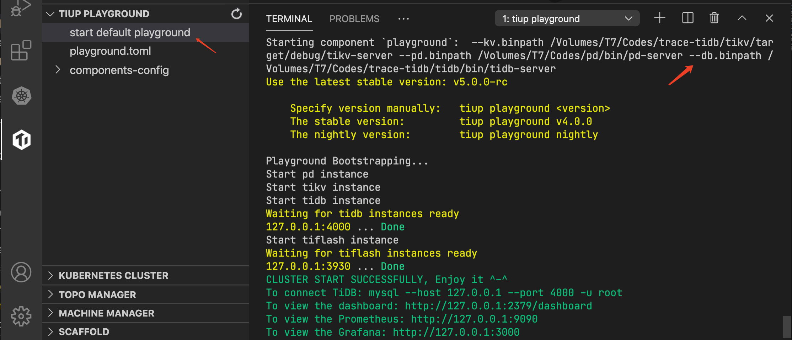
</div>

Clicking **start default playground** will automatically build the current tidb/tikv/pd repos and start a default playground cluster with them.

### Refresh to get topo

After playground is starting successfully, you can refresh the playground to get the topo.

<div>
  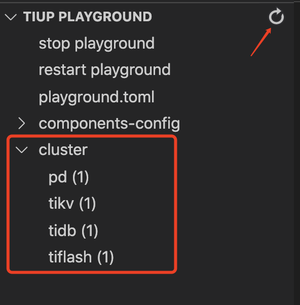
</div>

### View component log

Right click a component and select **View log** to view its log:

<div>
  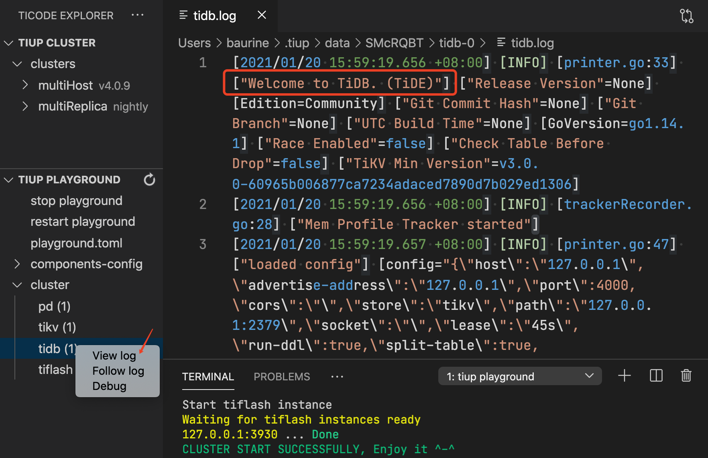
</div>

### Debug

You can debug the whole playground cluster or a single component by just clicking **Debug** in the cluster or a single component.

<div>
  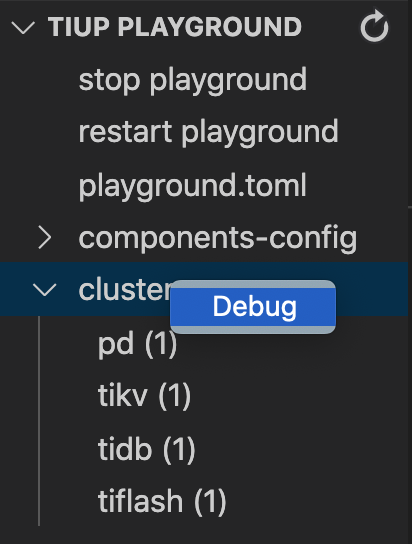
</div>

<div>
  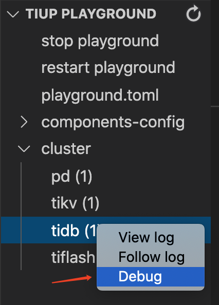
</div>

### Start configured playground

If you just want to test certain binaries instead of all, or you need more than 1 instance for the component, you need to start a configured playground.

Click **playground.toml**, and modify the content. To say I just want to test tidb repo, just uncomment the following line:

```toml
"db.binpath" = "current" # current means to use the current repo binary, will fallback to default binary if it doesn't exist
```

You can also assign the tidb with a special configuration, modify the `components-config/tidb.config` and uncomment the following line:

```toml
"db.config" = "components-config/tidb.config"
```

Click **Start playground by config**:

<div>
  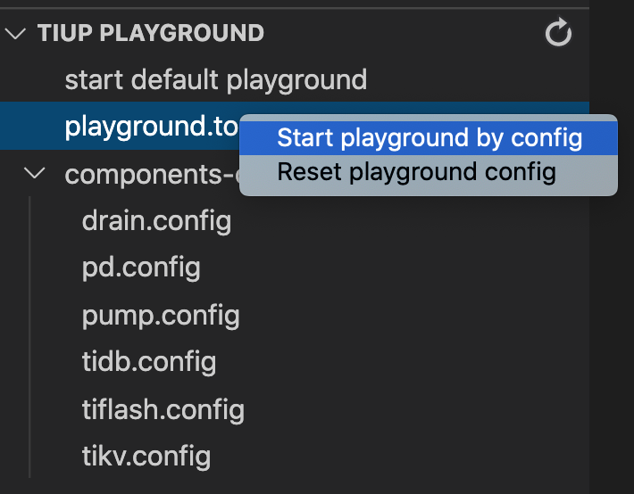
</div>

## 5. Use VM & Topo manager

When you don't have enough physical machines to deploy a real TiDB cluster, you can use vagrant to create some virtual machines and deploy the cluster to them.

This feature supports manage virtual machines (create/destroy/reload) by vagrant, and deploy a cluster to virtual machines or physical machines.

<div>
  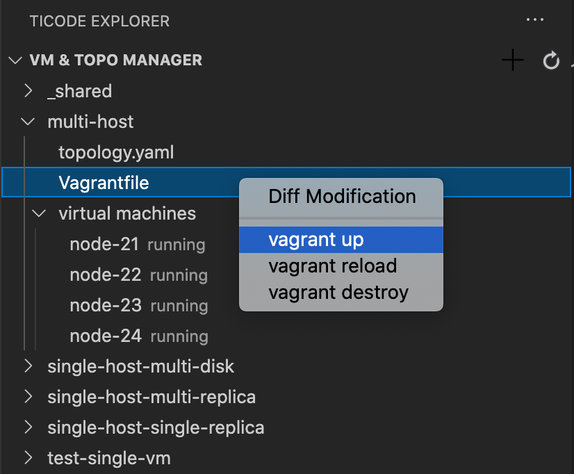
</div>

<div>
  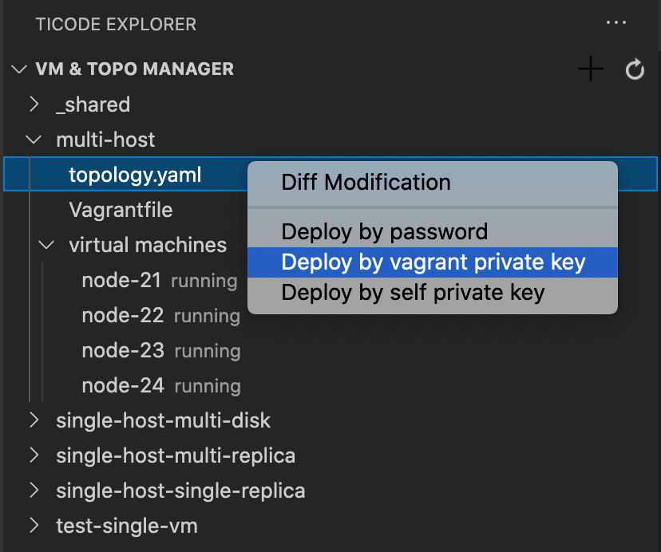
</div>

## 6. Use clusters

Assume you have deployed some clusters by `tiup cluster` command manually. (We will support it later.) You can manage the clusters in this extension.

- Start/Stop/Restart/Destory cluster, Open dashboard/grafana

  <div>
    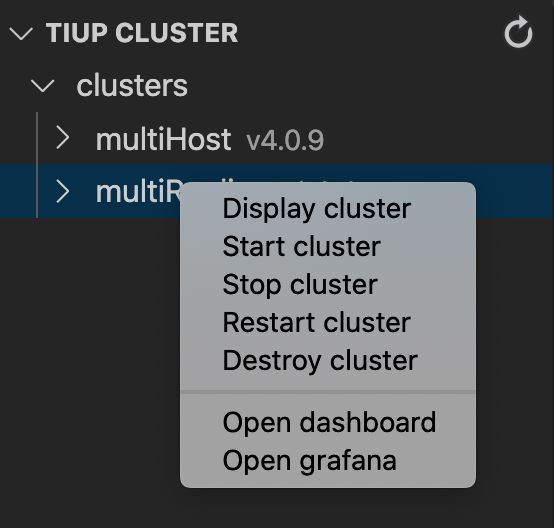
  </div>

- Modify and apply cluster configuration

  <div>
    
  </div>

- Restart/Patch component

  <div>
    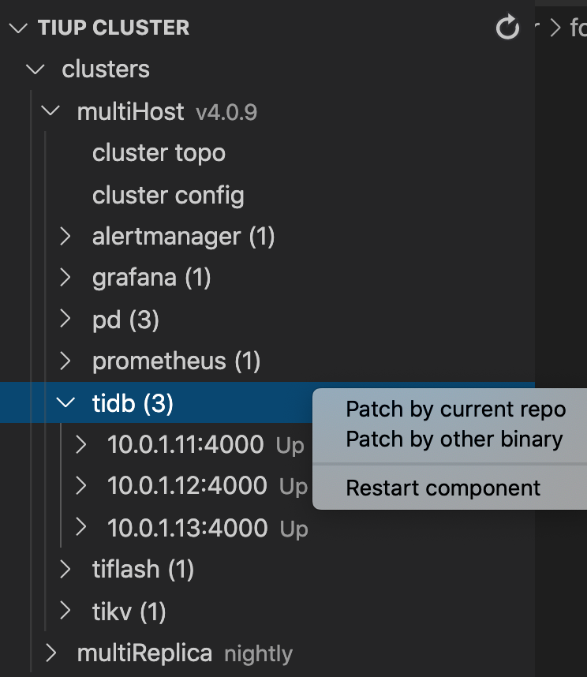
  </div>

- Restart/Patch/Debug/SSH instance

  <div>
    
  </div>

- View instance log

  <div>
    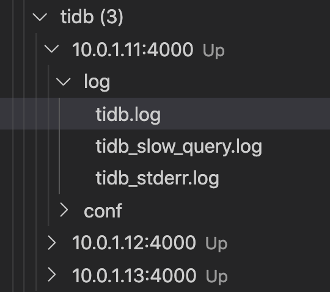
  </div>

- Modify and apply instance configuration

  <div>
    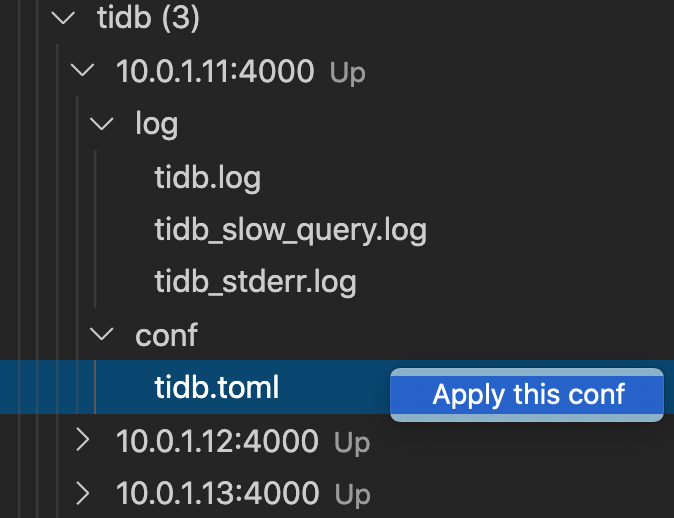
  </div>

## 7. Use scaffold

(currently we only support add new app to dashboard, we will add more later.)

### Add new app to dashboard

At first, we need to start the dashboard in development mode, just one click:

<div>
  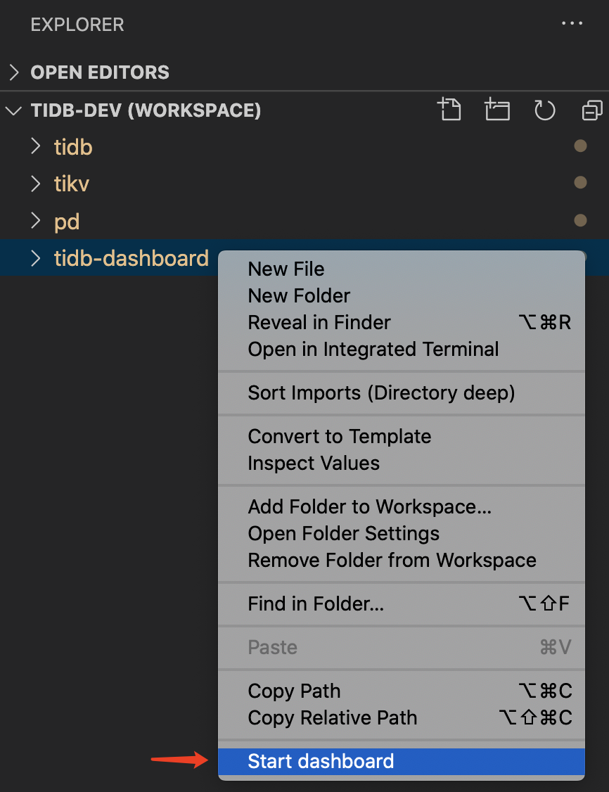
</div>

It will do three things:

1. Start a playground if there is no a playground running
1. Start the dashboard backend
1. Start the dashboard frontend

Assume you want to add a new individual feature (aka an "app") to dashboard, click the "Add new app to dashboard", input the app name, it will auto generate the template code for you, and auto restart the dashboard as well.

<div>
  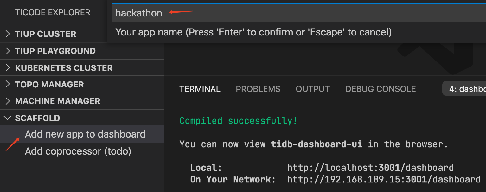
</div>

<div>
  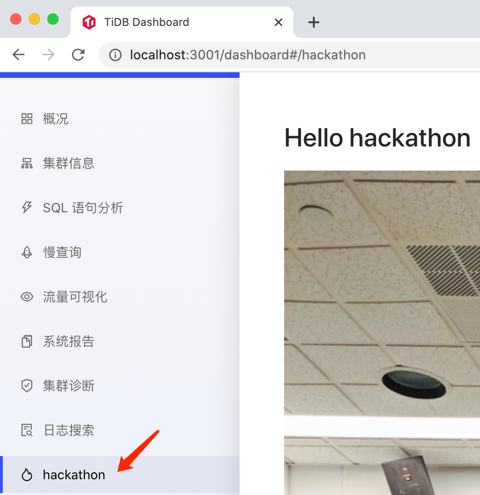
</div>
